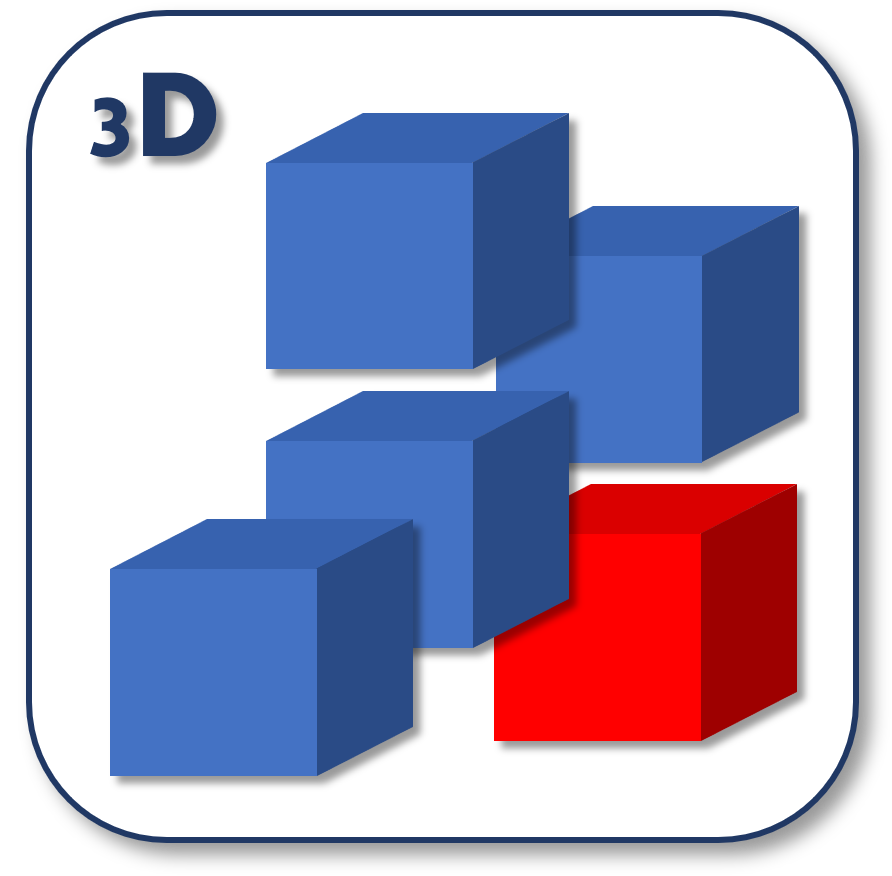

 laschola
====

Laschola is mainly a toolpath generator for 3D printers．It loads 3D voxel models(only OBJ) and converts it into G-code．
The project was started 2018 by Kakeru Kojima of Ueda laboratory in Nihon University ,and handed over a member of ueda lab．

## Features
* G-code generation for FFF/FDM printer
* Using voxel model，it can make the mechanical design details．

## language
Laschola is written by Python3.6．

## Future
To be loaded with Artificial intelligence and analysis coordination

## Install
You can download on Github．
### Dependencies
Python
Numpy
Matplotlib
mecode

## Directory structure
* `slicer`: the python source of the ` laschola` executable
* `utils`: various useful scripts

## Contribution
* **Development
   *　**Construct GUI
*　Diversify import model
* Contribute to the Manual
* Please call ueda lab in the case of collaborative investigation．( http://www.mech.cst.nihon-u.ac.jp/studies/ueda/)

## Licence
MIT

## Others
Please call ueda lab.( http://www.mech.cst.nihon-u.ac.jp/studies/ueda/)
